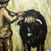

# michaelr's dotfiles

&nbsp;
&nbsp;
&nbsp;
&nbsp;
[^1]

[^1]: Images courtesy of open ai dall-e. variations of "man shaving a yak"

> This is my system config. There are many like it, but this one is mine.
>
> My system config is my best friend. It is my life. I must master it as I must
> master my life.[^2]

[^2]: Adapted from 'My Rifle – The Creed of a United States Marine'

